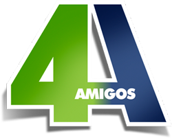

   
    
  <!-- <h1>4AMIGOS</h1> -->

<h4 align="center">ᴀᴘʟɪᴄᴀᴛɪᴠᴏ ᴘᴀʀᴀ ᴄᴏᴍᴘᴀʀᴛɪʟʜᴀʀ ᴀ ᴢᴏᴇɪʀᴀ, ғɪɢᴜʀɪɴʜᴀs ᴇɴɢʀᴀᴄᴀᴅᴀs ᴅᴏs ᴄᴏᴍᴇᴅɪᴀɴᴛᴇs, ᴀᴜᴅɪᴏs ᴇ ᴘɪᴀᴅᴀs. ᴘᴀʀᴀ ǫᴜᴇᴍ ɴᴀᴏ ᴏs ᴄᴏɴʜᴇᴄᴇ, ʀᴇᴄᴏᴍᴇɴᴅᴏ <b><a href="https://www.youtube.com/channel/UCYM04a9yva0wMQ7bPlii4rg" target="_blank">4ᴀᴍɪɢᴏs</a></b>.</h4>

  
  
  
  
  
  

  <a href="#4amigos-app">Projeto</a>&nbsp;&nbsp;&nbsp;|&nbsp;&nbsp;&nbsp;
  <a href="#resumo-%EF%B8%8F">Sobre</a>&nbsp;&nbsp;&nbsp;|&nbsp;&nbsp;&nbsp;
  <a href="#funcionalidades-%EF%B8%8F">Funcionalidades</a>&nbsp;&nbsp;&nbsp;|&nbsp;&nbsp;&nbsp;
  <a href="">Download</a>

    <a href="README-in.md">Inglês</a>
    ·
    <a href="README.md">Português</a>

 <!--green and blue: #4dc71f, #0d0d8a ou #409900, #041760
<h1>4AMIGOS APP 🤣</h2>-->

## 4AMIGOS APP 🤣
Esse é um aplicativo para compartilhar a zoeira, figurinhas engraçadas dos comediantes, audios e piadas.
O aplicativo **NÃO É OFICIAL** dos 4AMIGOS, ele foi desenvolvido por um fã(eu) para demonstrar o reconhecimento do trabalho excelente que eles fazem e compartilhar parte dela para outras pessoas.

É importante ressaltar que não estou querendo ganhar dinheiro em cima da imagem dos 4AMIGOS, claro o aplicativo vai ter banners ads mas se em algum momento a equipe ou os comediantes se sentirem incomodados eu posso sem problema algum dar todo o dinheiro arrecadado ou até mesmo tirar o apk do ar.

Caso a equipe tenha interesse neste app, favor entrar em contato via e-mail.

## Resumo 📃✍️
...

## O que há de novo? 🤔
05/06/2020 - versão alpha 0.2
- Ajustes e polimentos no layout (fragment_figurinhas)
- Implementado actionBar (activity_sticker_pack_list e activity_sticker_pack_details)

## Desenvolvimento 🔨
em desenvolvimento...

## Funcionalidades 🎖️
...

## Contribuição 💭
Adoraría aceitar seus patches e contribuições para este projeto. Fico muito grato, sinta-se a vontade para fazer suas alterações de acordo com o que está estabelecido na licença Apache-2.0, quero muito que esse projeto cresça!

Caso goste do projeto me apoie com um donate simples no Picpay: <a href="https://picpay.me/Matheus_nyctibius_vii">@Matheus_nyctibius_vii</a> , vocês não tem ideia do quão isso irá me incentivar. 

Outra forma de contribuição seria você baixar e fazer uso do meu app na Google Play.
<h4>⚠Disponível em breve...⚠</h4>

## Criador 👨‍💻
Olá para quem está lendo, quem fala é um adolescente de 18 anos, me chamo Matheus de Oliveira Vidigal Peixoto Dias e... sim meu nome é grande kk, moro em são paulo e fiz um curso técnico em uma ong chamada [CEAP PEDREIRA](https://pedreira.org/) onde estudei muitas linguagens e tecnologias que hoje são minha base. 

Bom.. sou novo nessa área de tecnologia mobile, começei em janeiro deste ano(2020) e mergulhei no Android Studio porque já sabia alguns conceitos básicos de java que tinha aprendido. O aplicativo do 4AMIGOS é um projeto pessoal em que estou me arriscando, gosto bastante da ideia de trabalhar com aplicativos e talvez no futuro jogos, esse é meu intuito e estou focando bastante nisso, mas claro! dois passos de cada vez.

## Licença ⚖️
Esse projeto está sob a licença Apache-2.0. Veja o arquivo [LICENSE](https://github.com/NyctibiusVII/4AMIGOS-app/blob/master/LICENSE) para mais detalhes.

## Contato ✉️
|  <a href="https://www.instagram.com/nyctibius_vii/?hl=pt-br">@MatheusVidigal🦊</a> |
| :---: |

	
   
   

